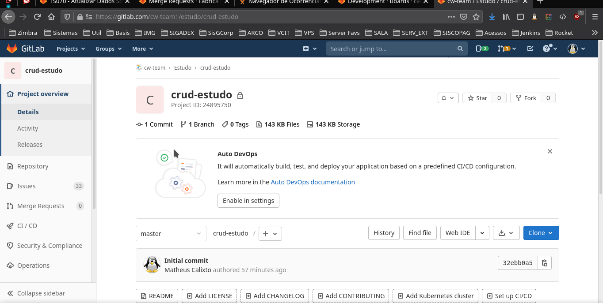

# mobile-estudo

## Introdução

As tecnologias utilizadas na célula web, para o desenvolvimento mobile, são:

- Backend (API)
   - Framework Spring Boot [Link de apoio](https://www.algaworks.com/meus-cursos/angular-rest-spring-boot) e [Link de Apoio](https://www.youtube.com/watch?v=bCzsSXE4Jzg&list=PL62G310vn6nFBIxp6ZwGnm8xMcGE3VA5H)
   - Bancos de dados Relacionais
   - Liquibase [Link de apoio](https://docs.liquibase.com/change-types/community/home.html)
   - Laravel [Link de Apoio](https://www.schoolofnet.com/curso/php/laravel/iniciando-com-laravel-8/)

- Mobile
   - Flutter [Link de Apoio](https://www.udemy.com/course-dashboard-redirect/?course_id=1764438) e [Link de Apoio](https://www.cod3r.com.br/courses/flutter-desenvolva-um-cadastro-completo)
   - Ionic [Link de Apoio](https://ionicframework.com/#) [Link de Apoio - Simon Grimm com tutoriais de Ionic] (https://www.youtube.com/user/saimon1924)
   
- Controle de Versão
   - GIT [Link de Apoio](https://www.udemy.com/course/git-e-github-para-iniciantes/)

- Sistema Operacional
   - Linux (Desejável conhecimentos básicos em versões baseadas no Debian. Ex: Linux Mint e Ubuntu) [Link de apoio](https://www.udemy.com/course/primeiros-passos-no-linux/)

- Infraestrutura
   - Conhecimentos básicos em Docker [Link de Apoio](https://www.udemy.com/course/curso-docker/)


Com base nessas tecnologias, segue uma proposta de criação de um CRUD (Inserir, Editar, Pesquisar, Deletar) ...

## Proposta

Desenvolvimento de um CRUD simples utilizando as tecnologias apresentadas acima. Principalmente:

- Controle de Versão do Código com GIT
- Utilização do Framework Spring Boot ou Laravel para API no Backend
- Utilização de Flutter para a criação do aplicativo Mobile, para Android e iOS, ou Ionic 5
- Utilização de um banco de dados Relacional (MariaDB)
- Utilização do Liquibase para versionamento do Banco de Dados ou em caso da utilização do Laravel, as migrations

O desenvolvedor deve criar um mini app mobile, que envolve autenticação de usuário utilizando Usuário e Senha, uma tela de cadastro de perfis, usuários e associação de permissão aos perfis.

- Etapas:

   - O aplicativo se iniciará na tela de login, onde o usuário cadastrado entrará com os dados de Login e Senha.
   
   - Haverá um menu para acesso às opções de cadastro: Usuário, Perfil, e Atribuição de Permissões. Apenas usuários que tenham as devidas permissões poderão acessar as telas.
   
   - As permissões serão predefinidas, e deverão ser adicionadas ao banco de dados previamente, por meio de Migrations ou Liquibase. Serão elas:

      - ROLE_CADASTRO_USUARIO
      - ROLE_CADASTRO_PERFIL
      - ROLE_LISTAGEM_USUARIO
      - ROLE_ACESSO_SISTEMA
      - ROLE_CONCEDER_PERMISSAO
   
      E no momento do login, as permissões devem ser carregadas para o usuário logado.
   
   - Caso o usuário não tenha permissão para acessar um menu específico, este não deve ser exibido.

   - Deverá haver previamente um usuário já cadastrado (admin) com o perfil de Administrador, que tenha todas as permissões.

- Descrição de Campos:

   - Usuário:

      - ID
      - Nome
      - Login
      - CPF
      - Senha
      - Perfil
   
   - Perfil:

      - ID
      - Nome
   

- O banco de dados deve ser criado utilizando um container Docker!
[Link de apoio](https://onexlab-io.medium.com/docker-compose-mariadb-5eb7a37426a2)


## Controle de tarefas

As tarefas estão na sessão Issues -> Board na página deste repositório no GitLab. Existem 4 status possíveis das tarefas:

- ToDo: A fazer
- In Progress: Em codificação
- Suspend: Suspensa por algum impedimento
- Closed: Tarefa Fechada

Deve-se atualizar sempre as tarefas que estão sendo realizadas de acordo com seu status, arrastando entre os quadros disponíveis.

Cada tarefa possui uma numeração, e essa numeração será a identificação do seu commit, e da sua branch! Como vai ser visto na sessão **Versionamento**.

Uma tarefa só é fechada, depois que o Calixto aprovar o Merge Request!



## Versionamento

Cada codificador deve puxar uma branch da branch **master** com o seguinte padrão: **dev-codigo_tarefa** e commitar nessa mesma branch utilizando o código de commit da tarefa. Exemplo:

- Tarefa de número 3.
- Branch: dev-3
- Mensagem de commit: #3 - Ajustada filtragem de dados


## Merge Requests

Assim que terminarem uma tarefa, vocês devem solicitar um Merge Request **da sua branch dev-X para a branch master específica de vocẽs.** (master-fulano). Exemplo:

- Merge request da branch: dev-1 para a branch master-fulano

O padrão do título dos merge requests segue a mesma ideia da mensagem de commit: **#3 - Desenvolvimento da tarefa X**


Depois de solicitado o merge request, deve-se enviar o Link do mesmo para o Calixto, no privado do Rocket Chat, para avaliação.

**ATENÇÂO**

- O limite máximo de arquivos Por merge request é de 25 arquivos modificados! Por isso, não deixem acumular tudo pra solicitar um MR só. Façam vários MR para cada tarefa, se necessário.

- Na descrição do Merge Request, favor adicionar um print com as seguintes evidências:

    - (Caso a API for Spring Boot)
      - Dentro da pasta do projeto do Backend (onde tem o pom.xml) rodar o comando:  
      ```bash
      mvn clean install -U -DskipTests -DskipITs
      ```
    - (Caso a API for em Laravel) 
      - Seguir as instruções da [Documentação](https://laravel.com/docs/5.2/testing) para criar os testes)
    

    


    
